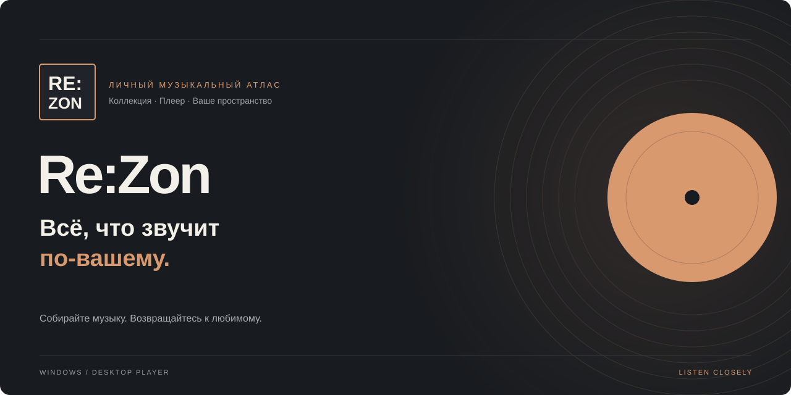
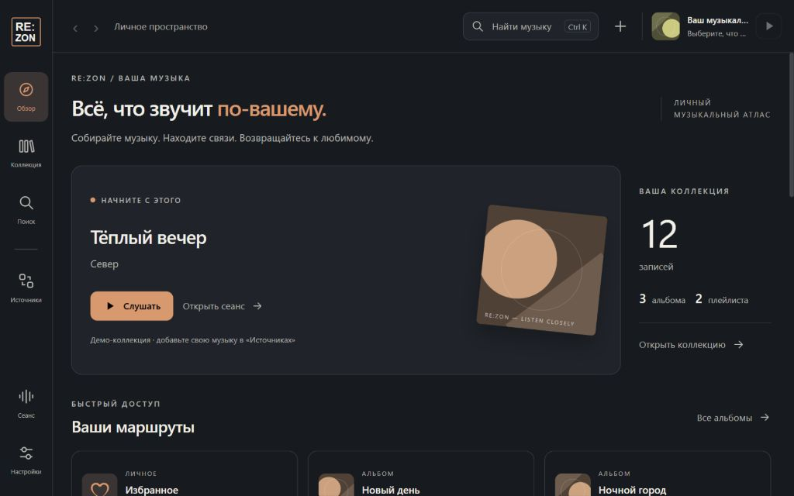

<div align="center">



**Личная музыкальная коллекция. Свой порядок. Свой ритм.**

Плеер для Windows, в котором музыка собирается вокруг вас.

[Выпуски и установщик](https://github.com/RedKamdelore/RE-Zon/releases) · [Возможности](#возможности) · [Запуск из исходников](#разработка) · [Сообщить об ошибке](https://github.com/RedKamdelore/RE-Zon/issues)


</div>

---

## Музыка, к которой хочется возвращаться

Re:Zon — пространство для вашей коллекции: локальных записей, альбомов, избранного и плейлистов. Найдите нужный трек, соберите очередь на вечер или откройте небольшой плеер и продолжайте заниматься своими делами.

Интерфейс **Atlas** сочетает графитовые поверхности, тёплые медные акценты и крупную типографику. В центре — музыка и обложки, а очередь и инструменты прослушивания собраны в боковой панели «Сеанс».



<sub>Обзор с демонстрационной коллекцией. Музыкальные записи на изображении — примеры оформления.</sub>

## Возможности

| Собрать своё | Слушать удобно | Настроить под себя |
| :--- | :--- | :--- |
| Локальная музыкальная коллекция | Очередь в панели «Сеанс» | Светлое и тёмное оформление |
| Альбомы, исполнители и плейлисты | Эквалайзер | Плотность коллекции, сетка и список |
| Избранное, поиск и фильтры | Компактный мини-плеер | Сохранение предпочтений |
| Ручной порядок треков в плейлисте | Управление воспроизведением | Каналы обновлений «Основное» и «Бета» |

### Четыре пространства

- **Обзор** — быстрый доступ к коллекции и любимой музыке.
- **Коллекция** — записи, альбомы и плейлисты с поиском, фильтрами и сортировкой.
- **Источники** — управление тем, откуда появляется ваша музыка.
- **Сеанс** — текущий трек, очередь и инструменты прослушивания рядом с основной страницей.

## Установка

1. Откройте [GitHub Releases](https://github.com/RedKamdelore/RE-Zon/releases).
2. В опубликованном выпуске скачайте **`ReZon-Setup-<версия>-x64.exe`** из раздела **Assets**.
3. Запустите установщик и выберите папку установки.
4. Откройте Re:Zon и добавьте свою музыку через «Источники».

**Платформа:** Windows x64. Проект находится в бета-тестировании. Если опубликованных выпусков пока нет, приложение можно запустить из исходников по инструкции ниже.

У текущей тестовой сборки нет цифровой подписи издателя: Windows может показать предупреждение. Перед тестированием с существующей коллекцией сохраните копию `%APPDATA%/rezon` при закрытом приложении.

## Обновления

В **Настройки → Обновления** можно выбрать канал, проверить новую версию и включить автоматическую проверку.

| Канал | Какие выпуски получает |
| :--- | :--- |
| **Основное** | Опубликованные стабильные версии |
| **Бета** | Бета-версии и более новые стабильные выпуски |

Загрузка показывает прогресс. Установка начинается по кнопке **«Установить и перезапустить»**, после проверки целостности файла. Переключение канала не устанавливает более старую версию.

<details>
<summary>Для чего нужны остальные файлы в Assets?</summary>

`beta.yml`, `latest.yml` и `.blockmap` нужны механизму обновлений. Скачивать их вручную не требуется. `SHA256SUMS.txt` содержит контрольные суммы файлов выпуска.

</details>

## Разработка

**Нужно:** Windows, Node.js 22.12+ и npm. Команды выполняются из папки с исходниками проекта.

```powershell
npm ci
npm run dev
```

| Команда | Действие |
| :--- | :--- |
| `npm run dev` | Запуск приложения в режиме разработки |
| `npx tsc --noEmit` | Проверка типов |
| `npm test` | Тесты |
| `npm run build` | Сборка приложения |
| `npm run dist` | Создание установщика Windows x64 |

Установщик и файлы обновлений появляются в `release/<версия>/`.

**Стек:** Electron · React · TypeScript · Zustand · electron-vite · electron-builder.

## Обратная связь

Нашли ошибку? [Создайте issue](https://github.com/RedKamdelore/RE-Zon/issues) и укажите:

- версию Re:Zon и Windows;
- шаги для повторения;
- ожидаемый и фактический результат;
- скриншот или текст ошибки, если это помогает.

Не прикладывайте пароли, токены, данные аккаунтов или личные музыкальные файлы. Идеи по интерфейсу и удобству тоже можно предлагать в Issues.

## Документация

- [Концепция интерфейса Atlas](docs/design-reboot-2026-09-18.md)
- [Сборка и выпуск обновлений](docs/releases/README.md)
- [Изменения и сценарии тестирования 0.4.0-beta.1](docs/releases/0.4.0-beta.1.md)

---

<div align="center">

**RE:ZON**<br>
<sub>Всё, что звучит по-вашему.</sub>

</div>
